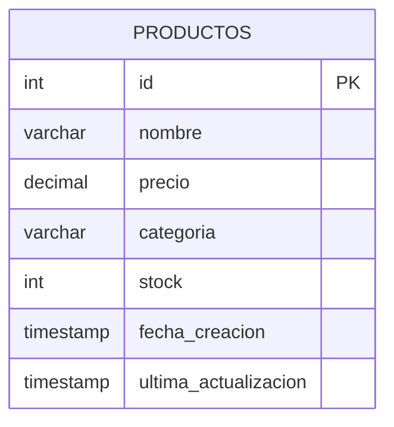

# Documentación de Base de Datos - EdiCommer Pro

## 📊 Esquema de Base de Datos

### Tabla: productos
```sql
CREATE TABLE productos (
    id INT AUTO_INCREMENT PRIMARY KEY,
    nombre VARCHAR(255) NOT NULL,
    precio DECIMAL(10,2) NOT NULL,
    categoria VARCHAR(100) NOT NULL,
    stock INT NOT NULL DEFAULT 0,
    fecha_creacion TIMESTAMP DEFAULT CURRENT_TIMESTAMP,
    ultima_actualizacion TIMESTAMP DEFAULT CURRENT_TIMESTAMP ON UPDATE CURRENT_TIMESTAMP
) ENGINE=InnoDB DEFAULT CHARSET=utf8mb4 COLLATE=utf8mb4_unicode_ci;
```

#### Descripción de Campos

| Campo               | Tipo          | Descripción                               |
|--------------------|---------------|------------------------------------------|
| id                 | INT          | Identificador único del producto          |
| nombre             | VARCHAR(255) | Nombre del producto                       |
| precio             | DECIMAL(10,2)| Precio del producto                       |
| categoria          | VARCHAR(100) | Categoría del producto                    |
| stock              | INT          | Cantidad disponible en inventario         |
| fecha_creacion     | TIMESTAMP    | Fecha de creación del registro           |
| ultima_actualizacion| TIMESTAMP    | Fecha de última modificación             |

## 🔍 Consultas Principales

### Listar Todos los Productos
```sql
SELECT * FROM productos
```
```

### Buscar Producto por ID
```sql
SELECT * FROM productos WHERE id = ?
```

### Agregar Producto
```sql
INSERT INTO productos (nombre, precio, categoria, stock) 
VALUES (?, ?, ?, ?)
```

### Actualizar Producto
```sql
UPDATE productos 
SET nombre = ?, precio = ?, categoria = ?, stock = ? 
WHERE id = ?
```

### Eliminar Producto
```sql
DELETE FROM productos WHERE id = ?
```

## � Estructura de Datos



## 📊 Validaciones

### Restricciones de Campos
- `nombre`: No puede ser NULL
- `precio`: No puede ser NULL ni negativo
- `categoria`: No puede ser NULL
- `stock`: No puede ser NULL, valor por defecto 0

## 🔒 Restricciones

### Productos
- El campo `nombre` no puede ser NULL
- El campo `precio` debe ser mayor que 0
- El campo `stock` no puede ser negativo
- El campo `sku` debe ser único

### Categorías
- El campo `nombre` debe ser único
- Referencias circulares no están permitidas en `parent_id`

## � Conexión a Base de Datos

### Configuración
```python
config = {
    "host": "bsgru36cv5yhisoln20d-mysql.services.clever-cloud.com",
    "user": "urj89clk903d2hgj",
    "database": "bsgru36cv5yhisoln20d",
    "port": 21957,
    "ssl_disabled": True
}
```

### Manejo de Conexión
- Implementación de patrón Singleton
- Conexión persistente
- Manejo automático de reconexión
```

## 🔄 Mantenimiento

### Vacuum y Optimización
```sql
-- Optimizar tabla
OPTIMIZE TABLE productos;

-- Analizar tabla
ANALYZE TABLE productos;
```

### Backup
```sql
-- Backup completo
mysqldump -u [user] -p [database] > backup.sql

-- Backup solo estructura
mysqldump -u [user] -p --no-data [database] > schema.sql
```

## 📊 Vistas

### Vista de Productos Activos
```sql
CREATE VIEW v_productos_activos AS
SELECT 
    p.id,
    p.nombre,
    p.precio,
    p.stock,
    c.nombre as categoria_nombre
FROM 
    productos p
    LEFT JOIN categorias c ON p.categoria = c.id
WHERE 
    p.deleted_at IS NULL;
```

### Vista de Resumen de Stock
```sql
CREATE VIEW v_resumen_stock AS
SELECT 
    c.nombre as categoria,
    COUNT(*) as total_productos,
    SUM(p.stock) as stock_total,
    AVG(p.precio) as precio_promedio
FROM 
    productos p
    JOIN categorias c ON p.categoria = c.id
WHERE 
    p.deleted_at IS NULL
GROUP BY 
    c.nombre;
```

## 🔄 Procedimientos Almacenados

### Actualizar Stock
```sql
DELIMITER //

CREATE PROCEDURE sp_actualizar_stock(
    IN p_producto_id INT,
    IN p_cantidad INT
)
BEGIN
    UPDATE productos 
    SET stock = stock + p_cantidad,
        updated_at = CURRENT_TIMESTAMP
    WHERE id = p_producto_id;
END //

DELIMITER ;
```

### Insertar Producto
```sql
DELIMITER //

CREATE PROCEDURE sp_insertar_producto(
    IN p_nombre VARCHAR(255),
    IN p_descripcion TEXT,
    IN p_precio DECIMAL(10,2),
    IN p_stock INT,
    IN p_categoria VARCHAR(100)
)
BEGIN
    INSERT INTO productos (
        nombre, 
        descripcion, 
        precio, 
        stock, 
        categoria
    ) VALUES (
        p_nombre,
        p_descripcion,
        p_precio,
        p_stock,
        p_categoria
    );
END //

DELIMITER ;
```

## 📊 Consultas Comunes

### Productos por Categoría
```sql
SELECT 
    p.*,
    c.nombre as categoria_nombre
FROM 
    productos p
    JOIN categorias c ON p.categoria = c.id
WHERE 
    p.deleted_at IS NULL
    AND c.nombre = 'Electrónicos'
ORDER BY 
    p.precio DESC;
```

### Stock Bajo
```sql
SELECT 
    p.*,
    c.nombre as categoria_nombre
FROM 
    productos p
    JOIN categorias c ON p.categoria = c.id
WHERE 
    p.stock < 10
    AND p.deleted_at IS NULL
ORDER BY 
    p.stock ASC;
```

## 🔒 Seguridad

### Roles y Permisos
```sql
-- Crear rol para lectura
CREATE ROLE 'app_read';
GRANT SELECT ON edicommer.* TO 'app_read';

-- Crear rol para escritura
CREATE ROLE 'app_write';
GRANT SELECT, INSERT, UPDATE ON edicommer.* TO 'app_write';
```

### Usuario de Aplicación
```sql
CREATE USER 'app_user'@'localhost' IDENTIFIED BY 'password';
GRANT 'app_read', 'app_write' TO 'app_user'@'localhost';
```

## 📈 Monitoreo

### Consultas Lentas
```sql
SELECT 
    start_time,
    user_host,
    query_time,
    sql_text
FROM 
    mysql.slow_log
WHERE 
    query_time > 1
ORDER BY 
    query_time DESC;
```

### Uso de Índices
```sql
EXPLAIN ANALYZE
SELECT * FROM productos 
WHERE categoria = 'Electrónicos' 
AND precio BETWEEN 100 AND 500;
```